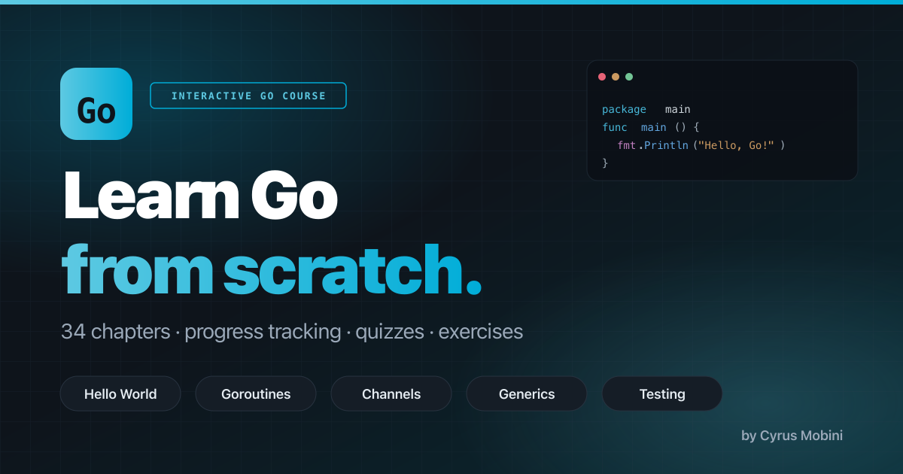

# Learn Go — Interactive Course

A complete, interactive Go programming course that covers every topic from absolute beginner to shipping idiomatic Go — syntax, types, interfaces, concurrency, testing, tooling, and a capstone CLI project. Quizzes after every chapter, hands-on exercises, and progress tracking. Free and open source.

**Live site:** https://cyrus2281.github.io/go-lang-course/
